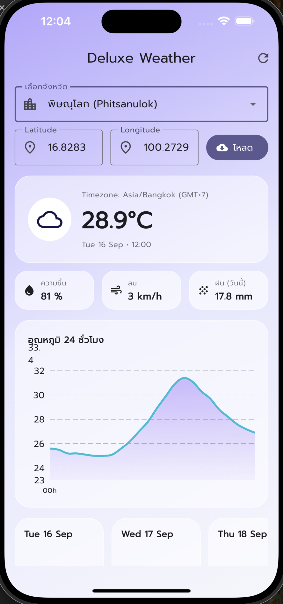
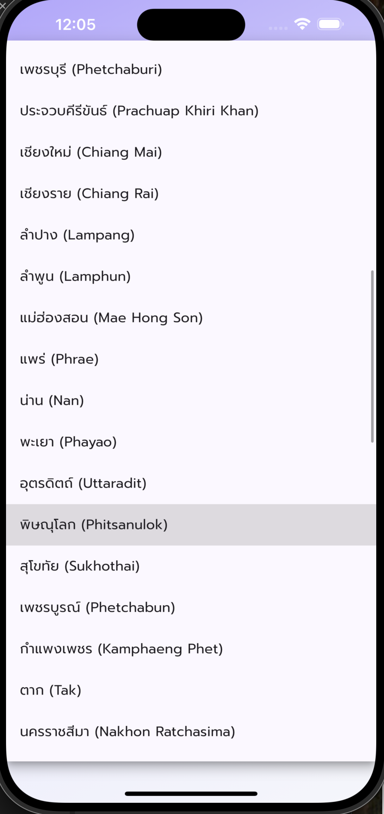

# ⭐ Open-Meteo Weather — Deluxe UI (Flutter + Provider + HTTP + Charts)

แอปตัวอย่าง **สวยจัดเต็ม** ดึงข้อมูลพยากรณ์อากาศจาก **Open-Meteo** รองรับค้นหา/เลือกจังหวัดไทย, การ์ดแบบ Glass, กราฟอุณหภูมิ, และโครงสร้างโค้ดที่แยกชั้นชัดเจน

---

## ⭐ สรุปคุณสมบัติ
- พื้นหลัง Gradient + **Glass Card**
- กราฟเส้นอุณหภูมิ 24 ชั่วโมง (fl_chart)
- **Quick Stats**: ความชื้น / ลม / ฝนวันนี้
- **ค้นหา/เลือกจังหวัด** (ไทย/อังกฤษ) → เติม lat/lon อัตโนมัติ แล้วโหลดข้อมูลทันที
- รายชั่วโมง (48 ชม.) + รายวัน (7 วัน)
- แยก **Model / Service / Provider / UI**

---

## ⭐ โครงสร้างโปรเจกต์
```
lib/
  data/th_provinces.dart            # จังหวัดไทย + พิกัด
  models/forecast.dart              # โมเดล Current/Hourly/Daily + แปลง JSON
  services/open_meteo_service.dart  # เรียก API
  providers/forecast_provider.dart  # จัดการสถานะ (ChangeNotifier)
  widgets/quick_stat.dart           # การ์ดสรุปแบบ glass (แก้ overflow แล้ว)
  widgets/weather_icon.dart         # map weather_code -> ไอคอน
  widgets/temp_chart.dart           # กราฟ fl_chart
  pages/home_page.dart              # UI หลัก
  main.dart                         # ธีม (ใช้ CardThemeData), ฟอนต์ Google
```

---

## ⭐ ติดตั้งและรัน
```bash
# หากเริ่มจากโปรเจกต์ว่าง
flutter create factor_api_weather
cd factor_api_weather

# คัดลอกโฟลเดอร์ lib/ และ pubspec.yaml จากชุดนี้ไปทับ
# จากนั้นติดตั้งแพ็กเกจ
flutter pub get

# รัน
flutter run
```

> ใช้ Flutter 3.22+ ได้ โดยตั้งค่าใน `ThemeData` ด้วย `CardThemeData` (ไม่ใช่ CardTheme)

---

## ⭐ อัปขึ้น GitHub
```bash
git init
git checkout -b main
git add .
git commit -m "feat: Deluxe Open-Meteo weather app (Provider + Charts + Province Search)"
git remote add origin https://github.com/<your-username>/<your-repo>.git
git push -u origin main
```

---

# ⭐ เอกสารขั้นตอนการดำเนินการอย่างละเอียด

## ⭐ ศึกษาการใช้งาน API จาก URL
**Endpoint:** `https://api.open-meteo.com/v1/forecast`  
**พารามิเตอร์หลัก**
- `latitude`, `longitude` — พิกัดจุดที่ต้องการพยากรณ์
- `current` — ฟิลด์สภาพอากาศปัจจุบัน (เช่น `temperature_2m,relative_humidity_2m,weather_code,wind_speed_10m`)
- `hourly` — ตัวแปรรายชั่วโมงที่ต้องการ (เช่น `temperature_2m,relative_humidity_2m,precipitation,wind_speed_10m`)
- `daily` — ตัวแปรรายวัน (เช่น `temperature_2m_max,temperature_2m_min,precipitation_sum,sunrise,sunset`)
- `forecast_days` — จำนวนวันพยากรณ์ (แอปนี้ใช้ 7)
- `timezone=auto` — ให้เวลาท้องถิ่นตามพิกัดอัตโนมัติ

**ตัวอย่าง** (กทม.):
```
https://api.open-meteo.com/v1/forecast
 ?latitude=13.7563
 &longitude=100.5018
 &current=temperature_2m,relative_humidity_2m,weather_code,wind_speed_10m
 &hourly=temperature_2m,relative_humidity_2m,precipitation,wind_speed_10m
 &daily=temperature_2m_max,temperature_2m_min,precipitation_sum,sunrise,sunset
 &forecast_days=7
 &timezone=auto
```

---

## ⭐ การใช้งานข้อมูลจาก API: สร้าง Class สำหรับข้อมูล
เราแยก **Model** ไว้ใน `lib/models/forecast.dart` เพื่อแม็ปโครงสร้าง JSON → **CurrentWeather / HourlyWeather / DailyWeather / ForecastResponse**

แนวคิดสำคัญ:
- Open-Meteo ส่ง `hourly` และ `daily` เป็น “หลายอาร์เรย์ที่ index ตรงกัน” เช่น `time[i]` จับคู่กับ `temperature_2m[i]`
- เราจึงวน index เพื่อประกอบเป็นออบเจ็กต์รายการ

```dart
class HourlyWeather {
  final DateTime time;
  final double? temperatureC;
  final num? humidity;
  final double? precipitationMm;
  final double? windSpeedKmh;
  ...
}

class ForecastResponse {
  factory ForecastResponse.fromJson(Map<String, dynamic> json) {
    // อ่าน current/hourly/daily และประกอบเป็น List<HourlyWeather>, List<DailyWeather>
  }
}
```

---

## ⭐ หลักการใช้งาน HTTP และ Provider
- ใช้แพ็กเกจ **http**: `http.get(Uri.https(...))` → ตรวจ `statusCode` → `json.decode()`
- แยกเลเยอร์ Service ใน `services/open_meteo_service.dart`
- ใช้ **Provider (ChangeNotifier)** สำหรับ state management:
  - สถานะ: `idle/loading/loaded/error`
  - ฟังก์ชัน `load()` ทำงาน: set loading → call service → set data/error → `notifyListeners()`
  - UI ใช้ `context.watch()` เพื่อ rebuild อัตโนมัติ

```dart
enum ForecastStatus { idle, loading, loaded, error }

class ForecastProvider extends ChangeNotifier {
  ForecastStatus status = ForecastStatus.idle;
  ForecastResponse? data;
  String? error;

  Future<void> load({double? lat, double? lon}) async { ... }
}
```

---

## ⭐ การนำ HTTP และ Provider มาใช้งานในแอป
- `main.dart` ลงทะเบียน `ChangeNotifierProvider(ForecastProvider)`
- `HomePage` มี 3 ส่วนหลัก:
  1) **Autocomplete จังหวัด**: เลือกแล้วเติม lat/lon + โหลดข้อมูลอัตโนมัติ  
  2) ช่องกรอก **Latitude/Longitude** + ปุ่ม **โหลด**  
  3) พื้นที่แสดงผลตาม **สถานะ** (Loading/Error/Success)

โฟลว์:
1. ผู้ใช้เลือกจังหวัด (หรือกรอก lat/lon)
2. กด “โหลด” → `ForecastProvider.load()`
3. Service เรียก API → คืน `ForecastResponse`
4. Provider เซต `status=loaded` พร้อม `data` → UI อัปเดต

---

## ⭐ ออกแบบหน้าแอป: แสดงผลข้อมูล
- **Header ปัจจุบัน**: ไอคอนจาก `weather_code`, อุณหภูมิ ณ ปัจจุบัน, เวลา, timezone
- **Quick Stats** (แก้ overflow แล้ว): ความชื้น / ลม / ฝนวันนี้ (ค้นจาก daily)
- **กราฟอุณหภูมิ 24 ชม.**: `fl_chart` โค้งนุ่ม + area
- **รายวัน** (แนวนอน): วัน / Tmin–Tmax / ปริมาณฝนรวม
- **รายชั่วโมง (48 ชม.)**: เวลา / Temp / RH / ฝน / ลม

ดีไซน์: Gradient + Glassmorphism, ฟอนต์ Google (ไทย), Material 3

---

## ⭐ อธิบายโค้ดอย่างละเอียด (ไฮไลต์)
**Service** – `open_meteo_service.dart`
```dart
final params = {
  'latitude': latitude.toStringAsFixed(4),
  'longitude': longitude.toStringAsFixed(4),
  'current': 'temperature_2m,relative_humidity_2m,weather_code,wind_speed_10m',
  'hourly': 'temperature_2m,relative_humidity_2m,precipitation,wind_speed_10m',
  'daily': 'temperature_2m_max,temperature_2m_min,precipitation_sum,sunrise,sunset',
  'forecast_days': '7',
  'timezone': 'auto',
};
final uri = Uri.https('api.open-meteo.com', '/v1/forecast', params);
final resp = await http.get(uri);
if (resp.statusCode != 200) throw Exception('HTTP ${resp.statusCode}: ${resp.reasonPhrase}');
return ForecastResponse.fromJson(json.decode(resp.body));
```

**Provider** – `forecast_provider.dart`
```dart
status = ForecastStatus.loading; notifyListeners();
try {
  data = await _service.fetchForecast(latitude: latitude, longitude: longitude);
  status = ForecastStatus.loaded;
} catch (e) {
  error = e.toString();
  status = ForecastStatus.error;
}
notifyListeners();
```

**Autocomplete จังหวัด** – `home_page.dart`
```dart
Autocomplete<Province>(
  displayStringForOption: (o) => '${o.nameTh} (${o.nameEn})',
  optionsBuilder: (ctl) { ...filter ไทย/อังกฤษ... },
  onSelected: (p) {
    _latCtl.text = p.lat.toStringAsFixed(4);
    _lonCtl.text = p.lon.toStringAsFixed(4);
    context.read<ForecastProvider>().load(lat: p.lat, lon: p.lon);
  },
);
```

**แก้ RenderFlex Overflow** – `quick_stat.dart`
```dart
Row(
  children: [
    Icon(icon, size: 20),
    const SizedBox(width: 8),
    Expanded( // ป้องกันล้น
      child: Column(
        mainAxisSize: MainAxisSize.min,
        crossAxisAlignment: CrossAxisAlignment.start,
        children: [
          Text(label, maxLines: 1, overflow: TextOverflow.ellipsis),
          Text(value, maxLines: 1, overflow: TextOverflow.ellipsis),
        ],
      ),
    ),
  ],
);
```

---

## ⭐ หมายเหตุเวอร์ชัน Flutter
- ใช้ `CardThemeData` แทน `CardTheme` ใน `ThemeData.cardTheme` สำหรับ Flutter 3.22+
- หาก build iOS เจอปัญหา cache ให้ลอง `flutter clean && flutter pub get`


## 📸 Screenshots



# Deluxe-Weather
